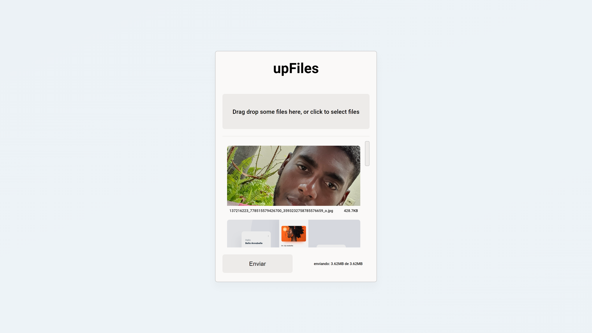

# upFiles

Faala Dev! Tudo Bom?

Essa é a minha versão da aplicação do Erick Wendel no seu [mini-curso](https://lnkd.in/ez_YHD2) 😃

### Como instalar

Faça o download deste repositório e acesse pelo terminal as pastas upFiles e ou API e execute o seguinte comando:

```js
  yarn install
  // or
  npm install
```

aguarde a finalização da instalação 😎

### API
Antes de iniciar a API você precisa configurar uma variavel ambiente! na raiz da pasta **API** crie um arquivo chamado **.env*** e dentro dele escreva ou cole o par chave/valor *API_PORT* (você pode encontrar um exemplo no arquivo .env.example)

```env
API_PORT = YOUR API PORT
```
Tudo certo, agora a API está configurada e pronta para ser iniciada

### Como Executar

Com o **upFiles** e a **API** instalados, abra um terminal de sua preferência e acesse a(s) pasta(s) **upFiles** e ou **API** e execute o(s) seguinte(s) comando(s):

```js
  // in upFiles folder
  yarn start
  // or, in API folder
  yarn dev:server
```

### Versão de produção

Para gerar uma versão de produção, repita o mesmo passo-a-passo da etapa anterior e execute o seguinte comando:

```js
  // in upFiles folder
  yarn buil
  // or, in API folder
  yarn dev:build 
  // access DIST folder
```

Após o build da API acesse a pasta **dist**


Pronto 😛, até a proxima!
